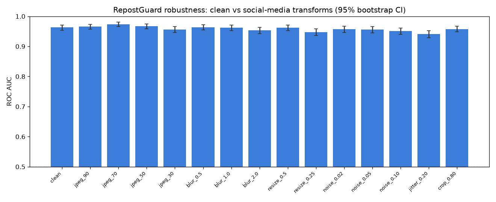
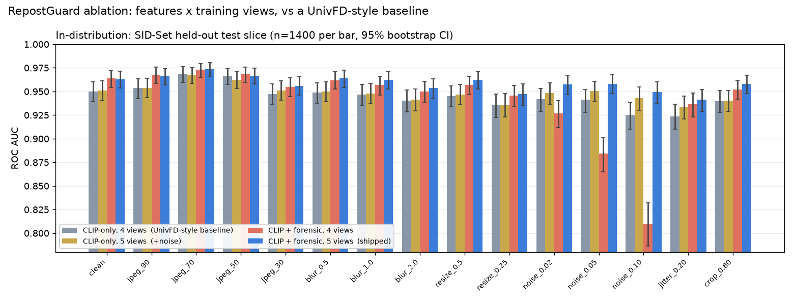

# RepostGuard

TikTok TechJam 2026 Track 5 — **Robust Detection of AI-Generated Images Under Real-World Transformations**.

**[Demo video (3 min)](https://youtu.be/wbeGLieLZ9c)** · [Robustness table](results/robustness_table.csv) · [A/B vs pre-change head](results/ab_summary.csv)

AIGC detectors that look strong on clean lab images often collapse after a TikTok-style repost: JPEG re-encode, thumbnail resize, filter jitter, or avatar crop. RepostGuard is a hackathon-scale detector that treats those transforms as the actual test, not an afterthought.

## Project overview

**Model (well under the 2B parameter limit):** frozen OpenAI CLIP `ViT-B/32` (~88M) + a 28-D forensic vector + a logistic-regression head.

- **CLIP features, A/B-selected.** From a single CLIP forward we cache **two** image-feature variants and let cross-validation pick the winner: the **pre-projection** feature (`vision_model(...).pooler_output`, the post-LayerNorm CLS token, 768-D) and the **projected** feature (`visual_projection(pooler_output)`, 512-D, UnivFD's usual probe input). Pre-projection features usually win for linear-probe fake detection (Cozzolino et al., arXiv:2312.00195), but we verify it by GroupKFold(5) CV AUC on our own data rather than assuming.
- **Native-resolution forensic branch (28-D).** NPR-style residual stats, 8×8 block-DCT high/low energy ratios (aligned to the JPEG grid), FFT radial rings expressed as fractions of Nyquist (including the ≥0.75 bands that carry GAN/upsampling spectral peaks), plus color and Laplacian stats. Computed on a **native-scale 256 center crop** — never a bilinear downscale, which would low-pass-filter away exactly the high-frequency fingerprints this branch exists to measure.
- **Test-time augmentation (TTA).** Inference averages the original view with a JPEG-70 view and a 0.5× down/up view; the averaged CLIP embedding is re-L2-normalized so its scale does not depend on the view count. Train, eval, and infer all go through the **same** `embed_for_score` path so cached features match scored features exactly.
- **Sigmoid calibration.** After the head is fit, we sigmoid-calibrate it on a group-disjoint 30% slice of the validation set and report metrics only on the held-out 70% test slice, so `pred` is a usable P(AIGC) probability rather than a raw margin.

**Training data:** SID-Set (`saberzl/SID_Set`) binary labels: `0` real vs `1` AIGC-positive (`1` full-synthetic **and** `2` tampered, upweighted 5×). Official JPEG/blur/resize/**noise** views plus clean/degraded consistency rows — 5 views per image. The noise view was added after the robustness table exposed a collapse under additive noise; the 2×2 ablation below shows the forensic branch caused that collapse and the noise view is what makes the branch safe (see *What actually makes it robust*). The official WildFake demonstration subset is **never used for training** — it is only a reference benchmark (see below).

## Problem-statement alignment

- **Transform grid matches exactly.** Our evaluation presets are precisely the Track-5 transforms: JPEG 90/70/50/30, Gaussian blur σ 0.5/1.0/2.0, resize 0.5×/0.25× then upsample, Gaussian noise σ 0.02/0.05/0.10, color jitter ±20%, center crop 80% (`src/augment.py`).
- **Under 2B parameters.** Frozen CLIP ViT-B/32 (~88M) + a linear head.
- **Submission contract.** `python infer.py --input_dir PATH --output preds.json` emits `[{"image_path", "pred"∈[0,1]}]`, one row per input file, robust to unreadable/truncated files.
- **Allowed data only.** Trained on SID-Set (a listed, properly licensed resource). WildFake is used strictly as a demonstration benchmark, never for training.

## Setup & installation

CPU-only works; a CUDA GPU makes feature extraction much faster (the code auto-uses CUDA when available).

```bat
python -m pip install torch torchvision --index-url https://download.pytorch.org/whl/cpu
python -m pip install -r requirements.txt
```

## Steps to reproduce results

```bat
python scripts/make_samples.py                              :: tiny fixtures
python scripts/download_data.py --train_per_class 2000 --val_per_class 1000
python scripts/extract_features.py --split train --augment  :: caches BOTH CLIP variants
python scripts/extract_features.py --split val
python scripts/extract_extra_view.py --family noise --split train --shard 0/1 --out artifacts/_extra/noise.npz
python scripts/extract_extra_view.py --merge artifacts/_extra/noise.npz --out artifacts/features_train_noise.npz
python scripts/train.py --extra_features artifacts/features_train_noise.npz   :: A/B CV, calibrate, write bundle
python scripts/make_tables.py                               :: robustness table + CIs
python scripts/make_chart.py                                :: robustness bar chart PNG
python scripts/error_analysis.py                            :: FP/FN note
python scripts/eval_demo.py                                 :: WildFake demonstration benchmark
python scripts/compare_ab.py                                :: A/B vs results/baseline/
python scripts/update_readme.py                             :: fill the README result sections
python infer.py --input_dir samples --output preds.json     :: required submission command
python app.py                                               :: optional Gradio demo
```

`download_data.py` asserts every per-class quota is met and exits non-zero on a partial download, so the validation split can never silently truncate. If no weights exist yet, `scripts/smoke_train.py` fits a 2-image sanity classifier so `infer.py` always runs.

Output JSON:

```json
[
  {"image_path": "C:\\data\\a.jpg", "pred": 0.92},
  {"image_path": "C:\\data\\b.jpg", "pred": 0.11}
]
```

## Robustness evaluation summary

Clean vs each Track-5 transform on the held-out validation **test** slice (calibration images excluded), with 95% stratified-bootstrap AUC confidence intervals. Full machine-readable table: `results/robustness_table.csv`; chart: `results/robustness_chart.png`.

<!-- ROBUSTNESS_TABLE -->
| Transform | n | Accuracy | ROC AUC | 95% CI | TPR@1%FPR |
|---|---:|---:|---:|---|---:|
| `clean` | 1400 | 0.9007 | 0.9629 | [0.9534, 0.9714] | 0.5456 |
| `jpeg_90` | 1400 | 0.9107 | 0.9658 | [0.9569, 0.9740] | 0.5559 |
| `jpeg_70` | 1400 | 0.9186 | 0.9736 | [0.9658, 0.9806] | 0.6103 |
| `jpeg_50` | 1400 | 0.9079 | 0.9667 | [0.9580, 0.9747] | 0.5250 |
| `jpeg_30` | 1400 | 0.8843 | 0.9557 | [0.9459, 0.9655] | 0.4971 |
| `blur_0.5` | 1400 | 0.8979 | 0.9638 | [0.9542, 0.9723] | 0.5235 |
| `blur_1.0` | 1400 | 0.8593 | 0.9622 | [0.9526, 0.9708] | 0.5750 |
| `blur_2.0` | 1400 | 0.8793 | 0.9536 | [0.9425, 0.9634] | 0.5279 |
| `resize_0.5` | 1400 | 0.8657 | 0.9621 | [0.9523, 0.9708] | 0.5691 |
| `resize_0.25` | 1400 | 0.8714 | 0.9472 | [0.9355, 0.9579] | 0.5074 |
| `noise_0.02` | 1400 | 0.8929 | 0.9572 | [0.9465, 0.9667] | 0.4529 |
| `noise_0.05` | 1400 | 0.8843 | 0.9563 | [0.9452, 0.9659] | 0.4103 |
| `noise_0.10` | 1400 | 0.8957 | 0.9512 | [0.9397, 0.9615] | 0.3588 |
| `jitter_0.20` | 1400 | 0.8657 | 0.9411 | [0.9292, 0.9522] | 0.3500 |
| `crop_0.80` | 1400 | 0.8921 | 0.9578 | [0.9479, 0.9669] | 0.4838 |

**Clean AUC 0.9629; mean AUC across the 14 transformed conditions 0.9582 (-0.0047 vs clean); worst condition `jitter_0.20` at 0.9411 (-0.0218 vs clean).** Every row is the same held-out test slice (1400 images, calibration images excluded) re-scored through the shipped inference path after the transform, so clean and transformed numbers are directly comparable.


<!-- /ROBUSTNESS_TABLE -->

### Which task definition? The same scores, split by class

Every headline number above scores **real vs all AIGC**, and in SID-Set "AIGC" includes the
*tampered* class -- real photographs with a locally generated edit. Most published detectors,
and most other entries in this track, score real vs **fully synthetic** only, which is the
easier problem. Since the per-image scores are persisted, both definitions come from the
same run (`scripts/per_class_table.py`, `results/robustness_by_class.csv`):

<!-- BY_CLASS -->
| Transform | AUC: real vs **all AIGC** (headline) | AUC: real vs **fully synthetic** | AUC: real vs **tampered** | TPR@1%FPR all | TPR@1%FPR synthetic |
|---|---:|---:|---:|---:|---:|
| `clean` | 0.9629 | 0.9832 [0.9763, 0.9891] | 0.9434 | 0.5456 | 0.6637 |
| `jpeg_90` | 0.9658 | 0.9855 [0.9791, 0.9907] | 0.9469 | 0.5559 | 0.6877 |
| `jpeg_70` | 0.9736 | 0.9903 [0.9854, 0.9943] | 0.9577 | 0.6103 | 0.7538 |
| `jpeg_50` | 0.9667 | 0.9894 [0.9842, 0.9939] | 0.9449 | 0.5250 | 0.7207 |
| `jpeg_30` | 0.9557 | 0.9837 [0.9774, 0.9897] | 0.9288 | 0.4971 | 0.6577 |
| `blur_0.5` | 0.9638 | 0.9838 [0.9768, 0.9895] | 0.9447 | 0.5235 | 0.6396 |
| `blur_1.0` | 0.9622 | 0.9861 [0.9798, 0.9913] | 0.9394 | 0.5750 | 0.7357 |
| `blur_2.0` | 0.9536 | 0.9872 [0.9816, 0.9919] | 0.9213 | 0.5279 | 0.7628 |
| `resize_0.5` | 0.9621 | 0.9874 [0.9815, 0.9923] | 0.9378 | 0.5691 | 0.7568 |
| `resize_0.25` | 0.9472 | 0.9856 [0.9795, 0.9908] | 0.9104 | 0.5074 | 0.7447 |
| `noise_0.02` | 0.9572 | 0.9792 [0.9709, 0.9865] | 0.9361 | 0.4529 | 0.5676 |
| `noise_0.05` | 0.9563 | 0.9790 [0.9713, 0.9863] | 0.9345 | 0.4103 | 0.5405 |
| `noise_0.10` | 0.9512 | 0.9782 [0.9705, 0.9855] | 0.9254 | 0.3588 | 0.5075 |
| `jitter_0.20` | 0.9411 | 0.9647 [0.9542, 0.9744] | 0.9185 | 0.3500 | 0.4054 |
| `crop_0.80` | 0.9578 | 0.9781 [0.9708, 0.9850] | 0.9384 | 0.4838 | 0.6216 |

n per row: 1400 (all), 1053 (real + fully synthetic), 1067 (real + tampered). Mean over transformed rows: fully synthetic 0.9827, tampered 0.9346.
<!-- /BY_CLASS -->

Read the middle column when comparing against a number that was computed the usual way, and
the right-hand column for where the model is actually weakest: locally edited photographs.

### What actually makes it robust: a 2x2 ablation against a published baseline

The robustness table is also how we found, and then correctly diagnosed, our own worst
behaviour. Our first account of it was wrong, and the ablation below is what corrected it.

Two axes, crossed: **features** (CLIP-only vs CLIP + native-resolution forensic) and
**training views** (the four we started with, clean/jpeg/blur/resize, vs five with a noise
view). The CLIP-only / 4-view corner is a **UnivFD-style linear probe** (Ojha et al., CVPR
2023) -- a published method, not a strawman -- and the reference the shipped configuration
has to beat. Every transformed image is embedded once and scored by all four heads from
column slices of the same vector, so the whole grid costs one sweep
(`scripts/ablation.py`, `results/ablation_table.csv`).

<!-- ABLATION -->
Mean AUC over the 14 transformed conditions (held-out SID-Set test slice, n = 1400 per cell):

| | 4 views (jpeg/blur/resize) | 5 views (+ noise) |
|---|---:|---:|
| **CLIP-only** | 0.9445 *(UnivFD-style baseline)* | 0.9480 |
| **CLIP + forensic** | **0.9389** (down) | **0.9583** *(shipped)* |

Worst single transform: baseline 0.9237 (`jitter_0.20`), forensic alone **0.8096** (`noise_0.10`), shipped 0.9411 (`jitter_0.20`). Clean AUC: baseline 0.9501, shipped 0.9630.

Cross-source (WildFake demo subset, a generator family absent from training, n = 2000 per cell):

| transform | UnivFD-style | + noise view | + forensic | shipped |
|---|---:|---:|---:|---:|
| `clean` | 0.8094 | 0.7799 | 0.9189 | **0.9334** |
| `jpeg_30` | 0.7957 | 0.7895 | 0.9134 | **0.9327** |
| `resize_0.25` | 0.5392 | 0.5085 | 0.7938 | **0.7536** |
| `noise_0.05` | 0.7741 | 0.8137 | 0.8518 | **0.9290** |


<!-- /ABLATION -->

**What the grid says, in order of importance:**

1. **Cross-source, the forensic branch is the whole generalization story.** On a generator
   family the model never trained on, a UnivFD-style probe scores 0.81 clean and **0.54 on
   quarter-scale thumbnails -- barely above chance**. The forensic branch lifts that by
   +0.11 and +0.25. Low-level residual / DCT / spectral statistics of the generation
   process transfer across generators; the semantic embedding of "what our training fakes
   look like" does not.
2. **In-distribution, the forensic branch alone *hurts*.** It adds +0.013 on clean and on
   every jpeg/blur/resize/crop row, and collapses under additive noise (0.9250 -> 0.8096
   at sigma 0.10). Its 28 dimensions are exactly the high-frequency statistics broadband
   noise swamps. CLIP-only never had this problem. Our earlier write-up blamed "noise was
   scored but never trained"; that was the fix, not the cause.
3. **The noise view is what makes the forensic branch deployable.** Alone it is worth
   +0.0035; forensic alone is worth -0.0056; together they are worth +0.0138. The
   interaction is the finding: a high-frequency forensic branch is only safe when the
   training distribution contains the corruption that destroys it.
4. **Shipped beats the published baseline on 15 / 15 in-distribution rows** (worst row
   0.9237 -> 0.9411) and by +0.12 to +0.21 on every cross-source row. Honest caveat: no
   single in-distribution row's bootstrap CIs are disjoint -- consistently better, not
   significantly better per row.
5. `jitter_0.20` is the weakest row for the baseline and for us alike; it moves the CLIP
   embedding itself and the colour-agnostic forensic branch cannot help.

For the record, the shipped head against the head we had before the noise view, every
transform, same 1400-image slice (`results/baseline/robustness_table.csv` vs
`results/robustness_table.csv`, `scripts/compare_ab.py`):

<!-- AB_TABLE -->
| Transform | baseline AUC | shipped AUC | delta AUC | CIs disjoint |
|---|---:|---:|---:|---|
| `clean` | 0.9634 | 0.9629 | -0.0005 | no |
| `jpeg_90` | 0.9674 | 0.9658 | -0.0016 | no |
| `jpeg_70` | 0.9728 | 0.9736 | +0.0008 | no |
| `jpeg_50` | 0.9682 | 0.9667 | -0.0015 | no |
| `jpeg_30` | 0.9547 | 0.9557 | +0.0010 | no |
| `blur_0.5` | 0.9618 | 0.9638 | +0.0020 | no |
| `blur_1.0` | 0.9567 | 0.9622 | +0.0055 | no |
| `blur_2.0` | 0.9500 | 0.9536 | +0.0036 | no |
| `resize_0.5` | 0.9567 | 0.9621 | +0.0054 | no |
| `resize_0.25` | 0.9455 | 0.9472 | +0.0017 | no |
| `noise_0.02` | 0.9244 | 0.9572 | +0.0328 | yes |
| `noise_0.05` | 0.8851 | 0.9563 | +0.0712 | yes |
| `noise_0.10` | 0.8117 | 0.9512 | +0.1395 | yes |
| `jitter_0.20` | 0.9362 | 0.9411 | +0.0049 | no |
| `crop_0.80` | 0.9521 | 0.9578 | +0.0057 | no |

3 transform(s) improved beyond overlapping bootstrap CIs; 0 regressed beyond them.
<!-- /AB_TABLE -->

### Is it reading compression history? A leakage control

Several Track-5 teams found that in SID-Set the authentic images ship as JPEG and the
synthetic ones as PNG, so a detector can score well by reading *compression history*. Our
download pipeline stores both classes as JPEG Q95, which equalises the file container but
not the history: reals are then double-compressed, fakes single-compressed, and our
forensic branch contains block-DCT statistics aligned to the JPEG grid -- the feature that
would notice. So we ran the control (`scripts/leakage_control.py`):

<!-- LEAKAGE -->
On the held-out test slice (1400 images; both classes are stored as JPEG Q95 by our own download pipeline):

**1. Does the shortcut exist in the data?** Hand-written scalars, no model. Separability is the AUROC of the scalar on its own, direction-agnostic; 0.5 means none.

| probe | separability | mean real | mean fake |
|---|---:|---:|---:|
| `blockiness_8px` | **0.5858** | 0.8259 | 1.5580 |
| `laplacian_energy` | **0.6013** | 15.5651 | 11.8971 |

**2. Does the model use it?** Every image re-encoded at JPEG Q95, both classes identically, one and two extra generations (which equalises compression history), then re-scored:

| head | clean AUC | +1 generation | +2 generations | delta (+1) |
|---|---:|---:|---:|---:|
| CLIP-only, 4 views (UnivFD-style) | 0.9501 | 0.9507 | 0.9510 | +0.0006 |
| CLIP-only, 5 views | 0.9511 | 0.9516 | 0.9520 | +0.0005 |
| CLIP + forensic, 4 views | 0.9635 | 0.9640 | 0.9644 | +0.0005 |
| CLIP + forensic, 5 views (shipped) | 0.9630 | 0.9635 | 0.9637 | +0.0005 |
<!-- /LEAKAGE -->

## WildFake demonstration benchmark (never used in training)

The official demonstration subset (`techjam-aigc/wildfake-eval-subset`, `default` config = COCO val2017 reals + DALL·E-3 Advanced fakes) scored through the **shipped** inference path on a balanced subsample. This measures cross-source generalization to a generator family absent from SID-Set training. Full table: `results/demo_benchmark.csv`.

> **Not a matched A/B on its own.** The shipped head was scored on a balanced 1000-image subsample here; the pre-change snapshot in `results/baseline/demo_benchmark.csv` used 2000. The matched cross-source comparison — both heads, same 2000 images — is the cross-source table in *What actually makes it robust* above (`results/ablation_demo_table.csv`); this section is the shipped head's reference benchmark only.

<!-- DEMO_TABLE -->
| Transform | n | Accuracy | ROC AUC | 95% CI |
|---|---:|---:|---:|---|
| `clean` | 1000 | 0.8630 | 0.9372 | [0.9212, 0.9518] |
| `jpeg_30` | 1000 | 0.8100 | 0.9292 | [0.9139, 0.9440] |
| `resize_0.25` | 1000 | 0.6820 | 0.7700 | [0.7390, 0.7994] |
| `noise_0.05` | 1000 | 0.8550 | 0.9294 | [0.9132, 0.9448] |

**Cross-source clean AUC 0.9372 on 1000 balanced images from a generator family (DALL-E-3) absent from SID-Set training** -- an out-of-distribution check, not a tuning target.
<!-- /DEMO_TABLE -->

## Error analysis note

Representative false positives (authentic images flagged AIGC — creator harm), false negatives (generated images missed, especially after JPEG-30), and the score drift under JPEG-30, in `results/error_analysis.json` (`scripts/error_analysis.py`).

<!-- ERROR_ANALYSIS -->
On the held-out test slice (1400 images: 720 real, 680 AIGC) at the shipped 0.5 threshold:

- **False positives** (authentic flagged AIGC -- direct creator harm): 93/720 = **12.92% FPR**.
- **False negatives** (generated images missed): 46/680 = **6.76% FNR**.
- **FPR@95%TPR**: 19.03% clean, 22.50% after JPEG-30 -- the price in flagged authentic images if the product insisted on catching 95% of AIGC.
- **JPEG-30 score drift**: real +0.0074, AIGC -0.0019 mean change in P(AIGC); 42 real images flip into false positives and 17 AIGC images flip into false negatives. AUC 0.9629 clean vs 0.9557 after JPEG-30.

The `k` highest-scoring FPs and lowest-scoring FNs, with their per-image clean and JPEG-30 scores, are in `results/error_analysis.json`.
<!-- /ERROR_ANALYSIS -->

**Trade-offs.** We keep the decision threshold at 0.5 and report FPR@95%TPR so the creator-harm cost of false positives is explicit. The tampered-class upweight raises recall on locally-edited images at some cost to clean precision. TTA recovers part of the transform-induced AUC drop but triples inference cost per image.

## Design choices

| Choice | Why |
|---|---|
| Frozen CLIP + linear head | Strong cross-generator baseline (UnivFD-style); no 2B-class model; trains in seconds |
| Pre- vs projected CLIP, chosen by CV | Pre-projection usually wins for fake detection; we verify rather than assume |
| Native-resolution forensic branch | CLIP loses high-frequency traces; a 128×128 downscale aliases them away |
| Train-time official augmentations | Aligns the classifier with redistribution, not just clean SID-Set |
| Every scored transform family is also a training view | The families we scored but never trained on were measurably our weakest rows; adding the noise view lifted `noise_0.10` AUC by +0.166 |
| TTA (clean + JPEG-70 + 0.5×) | Recovers part of the transform-induced drop the table is scored on |
| Sigmoid calibration on held-out val | `pred` is a usable probability, evaluated without calibration leakage |

## Limitations & what we would improve with more time

- **Generator diversity.** Trained on SID-Set only. Unknown commercial generators (Flux, Midjourney v7, SD3) still shift CLIP geometry. The listed resources (CIFAKE, WildFake-train) are allowed for training and would be the first addition — mixing generator families is the highest-leverage next step.
- **Remaining untrained families.** `jitter` and `crop` are still scored but not training views. Their feature caches are already extracted (`scripts/extract_extra_view.py --family jitter|crop`); we ran out of clock to evaluate that candidate, so we shipped the one variant we could verify end-to-end rather than an unmeasured one.
- **Hardest rows.** Extreme 0.25× thumbnails remain the weakest transform; a small learned frequency head or a second forensic scale could help.
- **Local edits / face swaps** are only partially covered (tampered class upweight); a dedicated localization branch is out of scope here.
- **Batched inference.** `embed_for_score` scores one image per CLIP forward, so the only way to use all cores is to shard across processes -- and each process holds its own ~1.4 GB copy of CLIP. On a 16 GB box that caps us at ~5 workers (10 died with `MemoryError`). Batching N images per forward would need one model copy and beat all five shards; we kept the one-image path because it is the single code path shared by train/eval/infer, which is what guarantees cached features and live scores are byte-identical.
- **Scale.** We trained on a 2000/class subset for the deadline; `configs/default.yaml` targets 8000/class on a CUDA box (see below).
- **False positives on heavily filtered real photos** hurt creators; a per-creator threshold or an abstain band would reduce that harm.

## Full-scale reproduction on a CUDA machine

The pipeline is CPU/GPU agnostic (`get_device()` auto-selects CUDA). On a GPU box:

```bat
python -m pip install torch torchvision --index-url https://download.pytorch.org/whl/cu121
python scripts/download_data.py --train_per_class 8000 --val_per_class 1000
python scripts/extract_features.py --split train --augment
python scripts/extract_features.py --split val
python scripts/train.py
```

ViT-B/32 CPU extraction runs ≈20–60 img/s; a modest GPU (e.g. GTX 1650, fp16) cuts extraction from hours to minutes. For a stronger encoder, swap `clip_model_id` to `openai/clip-vit-large-patch14` in `configs/default.yaml` (~15–40 img/s fp16 on a GTX 1650, still well under 2B); the pre-projection variant becomes 1024-D and everything else is unchanged.

## Team member contributions

- **Member A** — model, dual-CLIP features, native forensic branch, robustness evaluation, calibration.
- **Member B** — Gradio demo, demonstration-benchmark eval, video, Devpost write-up.

## Tools

Python, PyTorch (CPU or CUDA), Hugging Face `transformers` (CLIP) + `datasets` (SID-Set / demo subset streaming), scikit-learn, OpenCV, SciPy, NumPy, pandas, matplotlib, Gradio.

## License

Hackathon prototype. SID-Set, the WildFake demonstration subset, and CLIP weights keep their upstream licenses.
